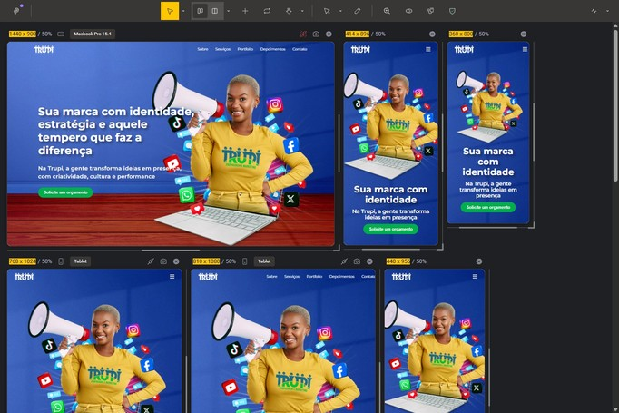

# 🚀 Trupi - Landing Page

> Uma landing page moderna, responsiva e estratégica, criada para destacar a identidade digital da Trupi, empresa de Marketing. O projeto evidencia expertise em design UI/UX e desenvolvimento front-end focado em performance e conversão.

[](https://simonen-landing-page.vercel.app/)


_Preview Desktop_


_Preview Mobile_


_Panorama Geral_


## 📋 Sobre o Projeto

Landing page no formato **one-page site**, desenvolvida para a Trupi, com o objetivo de reforçar presença online e transmitir profissionalismo. O trabalho foi realizado como parte de um **estudo prático**, valorizando a aplicação de técnicas avançadas de front-end e boas práticas de marketing digital.

## 🚀 Tecnologias & Funcionalidades

**Frontend:** React 18, JavaScript ES6+, Vite, CSS Modules
**Simulação de API:** json-server para depoimentos
**Design:** Adobe Photoshop, Figma

### ⚡ Principais Features

- Componentização avançada e reutilização de código
- Integração com API simulada (Google Reviews)
- Design responsivo compatível com interfaces mobile
- Identidade visual criada do zero

## 📱 Compatibilidade & Performance

- ✅ **Responsivo**: Desktop, Tablet, Mobile
- ✅ **Browsers**: Chrome, Firefox, Safari, Edge
- ✅ **Performance**: 95+ Mobile, 98+ Desktop
- ✅ **Acessibilidade**: Semântica HTML5, contraste adequado

## 🔧 Como Executar

```bash
# Clone o repositório
git clone https://github.com/keniofront/trupi-landing-page.git

cd trupi-landing-page

# Instale dependências e execute
pnpm install

pnpm run dev
```

## 💡 Principais Aprendizados

- Otimização de performance com Vite
- Implementação de CSS Modules para estilos isolados
- Simulação realista de APIs com json-server
- Design responsivo
- Gestão completa de projeto: do design à implementação

## 📈 Próximos Passos (Roadmap)

- Migração para Sass
- Animações e transições
- Otimização SEO avançada
- Implementação de testes unitários com Jest

## 🤝 Contribuição

Este é um projeto de portfólio, mas sugestões e feedbacks são sempre bem-vindos! Entre em contato para discussões técnicas ou oportunidades profissionais.

## 📞 Contato

- **LinkedIn**: https://www.linkedin.com/in/keniofront/
- **Email**: keniofront@gmail.com

---

**Desenvolvido com 💙 para demonstrar competências em React e desenvolvimento front-end moderno.**
